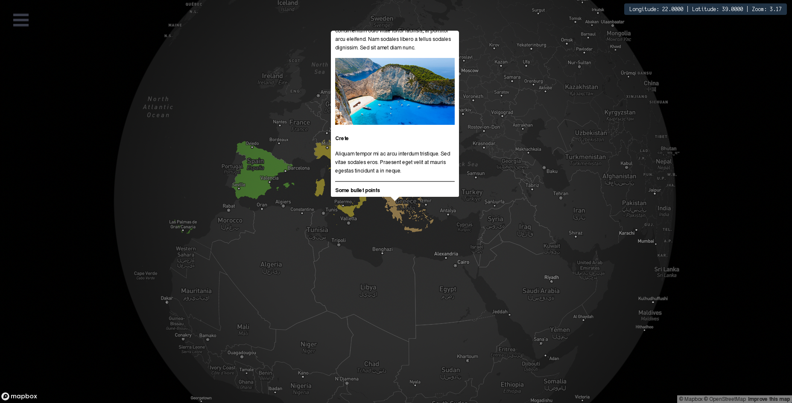
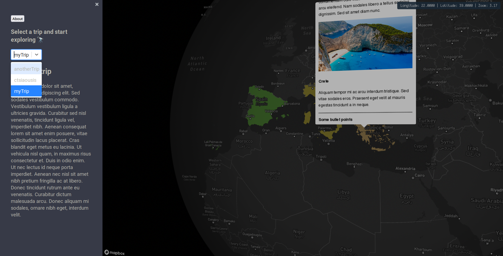

# Country Chalkboard

A creative way to keep a diary of your journeys.

A static website that parses markdown files and images, that depict one's journey/vacations, to project them on a globe.
Built with React, Mapbox, JavaScript, and CSS.

## Project Status

This project is currently in development.

#### Feature Tracking:
- [x] Parse countries from markdown and colorize them
- [x] Highlight active country boundaries
- [x] Display a pop-up with country info
- [x] Sidebar to select different trips
- [x] Trip summary displayed on sidebar
- [x] Auto focus first country when trip changes
- [x] Support embeded videos on country pop-ups
- [x] Add about section
- [x] Auto find available markdown files
- [ ] Support for (graphical) paths and country ordering
- [ ] Add regional boundary functionality
- [ ] Add city functionality
- [ ] Markdown folder structure
- [ ] Port to containerized web app with interactive creation tools

## Project Screen Shot(s)

## DEMO

[https://ctsiaousis.github.io/country-chalkboard/](https://ctsiaousis.github.io/country-chalkboard/).

## Installation Instructions

Clone down this repository. You will need `node` and `npm` installed globally on your machine.  

Installation:

`npm install`  

To Start Server:

`npm run start`  

To Visit App:

`localhost:3000/country-chalkboard`  

## Posting your AWESOME trip

1. Clone the repository: `git clone https://github.com/ctsiaousis/country-chalkboard`
1. Change dir: `cd ./country-chalkboard`
1. Create new local branch named *$USERNAME-trip*: `git checkout -B ctsiaousis-trip`
1. `cd ./src/markdown`
1. Create a markdown file named `$USERNAME.md` and compose your trip like the example `myTrip.md`
1. Add desired pictures in the `/src/markdown/pictures` folder
1. Add and commit your changes: `git add . && git commit -m "my awsome trip"`
1. Push your changes: `git push origin $USERNAME-trip` (your branch name)
1. Create a pull request to include them in the upstream

## Reflection

This was a two week long project built during my 2022 vacation. The goal was to initially deploy it as a static website that
utilizes **Github Pages** and can be *forked* by anyone to post their trips/vacation etc. I might sometime create a propr 
web application for it with users, online edit, commenting, notifications and so on. 

## Contributing

See [CONTRIBUTING.md](./CONTRIBUTING.md).