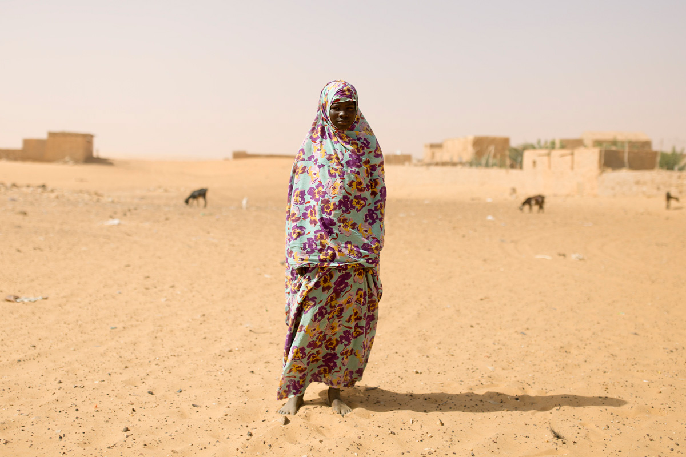

# My US trip

Lorem ipsum dolor sit amet, consectetur adipiscing elit. Sed sodales vestibulum commodo. Vestibulum vestibulum ligula a ultricies gravida. Curabitur sed nisl venenatis, tincidunt ligula vel, imperdiet nibh. Aenean consequat lorem sit amet enim posuere, vitae sollicitudin lacus placerat. Cras blandit eget metus eu lacinia. Ut vehicula nisl quam, in maximus risus consectetur et. Duis in odio enim. Ut nec lectus id neque porta imperdiet. Aenean nec nisl sit amet nibh pretium fringilla ac at libero. Donec tincidunt rutrum ante eu venenatis. Curabitur dictum malesuada arcu. Donec aliquam mi sodales, ornare nibh eget, interdum velit.

## Canada

### Had a fantastic time
Quisque commodo dictum odio, id vulputate lorem porttitor quis. Quisque viverra pellentesque orci, sed pharetra nibh condimentum eu. Etiam porta, augue quis tincidunt aliquet, sapien augue vehicula diam, vehicula consequat mauris odio vitae ante.

Cras feugiat urna a tortor fermentum, quis mattis metus scelerisque. Vestibulum augue arcu, porttitor sit amet dictum in, bibendum ut orci. Vivamus condimentum odio vitae tortor facilisis, at porttitor arcu eleifend. Nam sodales libero a tellus sodales dignissim. Sed sit amet diam nunc. 

## Brazil

Sed augue mi, fringilla vitae enim sed, ornare lacinia urna. Integer volutpat condimentum purus quis interdum. Donec non leo sed quam mattis tristique. Aenean fringilla suscipit luctus. Pellentesque commodo facilisis nulla. Fusce turpis tortor, cursus vitae eleifend at, ornare vulputate tortor. Praesent elementum lectus id magna dignissim, id rhoncus dui consectetur. Integer id tortor finibus, ullamcorper sem in, venenatis purus. Phasellus maximus magna at sapien scelerisque, nec volutpat urna dapibus. Nam a nisl gravida, laoreet mi pulvinar, dictum magna. Vivamus consectetur cursus libero, ac dapibus risus iaculis tincidunt. Quisque hendrerit lobortis tortor vel vehicula. Aliquam tempor mi ac arcu interdum tristique. Sed vitae sodales eros. Praesent eget velit at mauris egestas tincidunt a in neque. 

## Mauritania

One of Africa's newest oil producers, the Islamic Republic of Mauritania bridges the Arab Maghreb and western sub-Saharan Africa.

The largely-desert country presents a cultural contrast, with an Arab-Berber population to the north and black Africans to the south. Many of its people are nomads.

In the Middle Ages Mauritania was the cradle of the Almoravid movement, which spread Islam throughout the region and for a while controlled the Islamic part of Spain.

European traders began to show interest in Mauritania in the 15th century. France gained control of the coastal region in 1817, and in 1904 a formal French protectorate was extended over the territory.

Mauritania is rich in mineral resources, especially iron and ore. It is seen by the West as a valuable ally in the fight against Islamist militancy in the Sahel region. 
